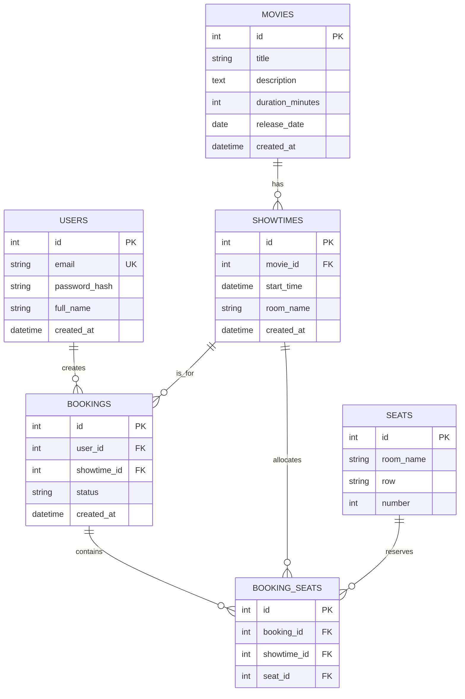

# Thiết kế database

## ERD

## Bảng và constraint

| Bảng | Primary key | Foreign key | Constraint / mục đích |
| --- | --- | --- | --- |
| `users` | `id` | — | `email` unique: một account cho mỗi email. Chỉ lưu Argon2 password hash. |
| `movies` | `id` | — | Movie catalogue. |
| `showtimes` | `id` | `movie_id → movies.id` | Một screening thuộc về một movie và có room name. |
| `seats` | `id` | — | `UNIQUE(room_name, row, number)` ngăn hai physical seat có cùng label trong một room. |
| `bookings` | `id` | `user_id → users.id`, `showtime_id → showtimes.id` | Lưu confirmed hoặc cancelled booking. |
| `booking_seats` | `id` | `booking_id → bookings.id`, `showtime_id → showtimes.id`, `seat_id → seats.id` | `UNIQUE(showtime_id, seat_id)` ngăn một seat được allocate hai lần trong cùng screening. |

## Vì sao booking unique constraint quan trọng

Availability check bằng Python chỉ là một snapshot. Hai transaction đều có thể thấy một seat available trước khi một transaction ghi dữ liệu. `UNIQUE(showtime_id, seat_id)` của PostgreSQL xử lý conflict tại thời điểm write: tối đa chỉ một `booking_seats` insert được commit. Transaction còn lại phát sinh integrity error; repository chuyển thành `SeatAlreadyBookedError`; API trả `409 Conflict`.

## Indexes

| Index | Query được hỗ trợ | Lý do |
| --- | --- | --- |
| `ix_users_email` | Login và duplicate-email lookup | Email được tìm khi login/registration. Unique constraint cũng bảo vệ correctness. |
| `ix_showtimes_movie_id`, `ix_showtimes_start_time`, `ix_showtimes_movie_id_start_time` | `GET /showtimes?movie_id=&date=` | Hỗ trợ filter theo movie, date range và tổ hợp phổ biến của chúng. |
| `ix_showtimes_room_name` | Lấy seat của room / administration query | Lookup trực tiếp theo room name. |
| `ix_bookings_user_id` | `GET /bookings/me` | Liệt kê booking history của user không cần scan toàn bộ bookings. |
| `ix_bookings_showtime_id` | Screening-level booking query | Hỗ trợ cinema administration feature về sau. |
| `ix_booking_seats_booking_id` | Xóa theo booking khi cancellation | Giải phóng allocation của booking hiệu quả. |
| `ix_booking_seats_showtime_id`, `ix_booking_seats_seat_id` | Seat availability và allocation inspection | Tìm allocation theo showtime hoặc physical seat. Unique pair vẫn bảo đảm correctness. |

Indexes được giới hạn theo access path đã biết; Phase 1 không thêm speculative index.
